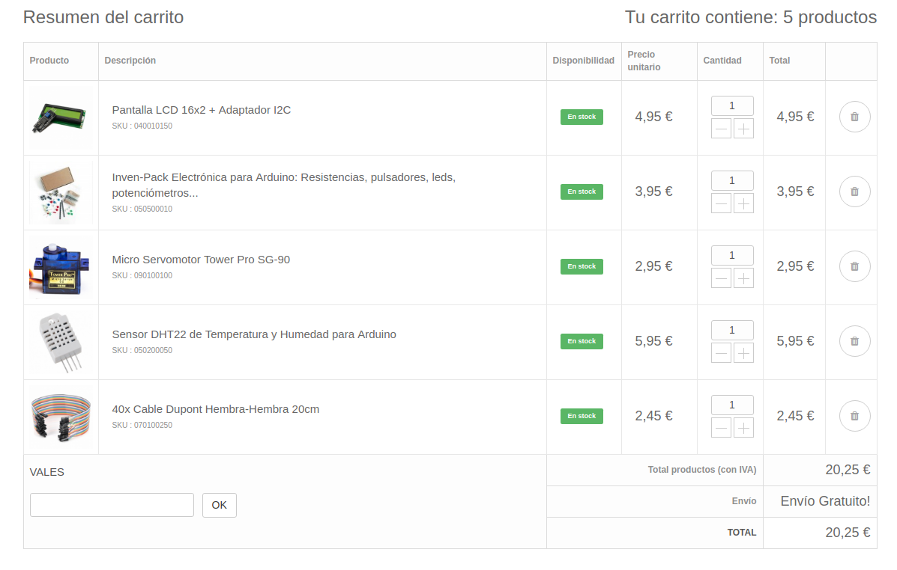
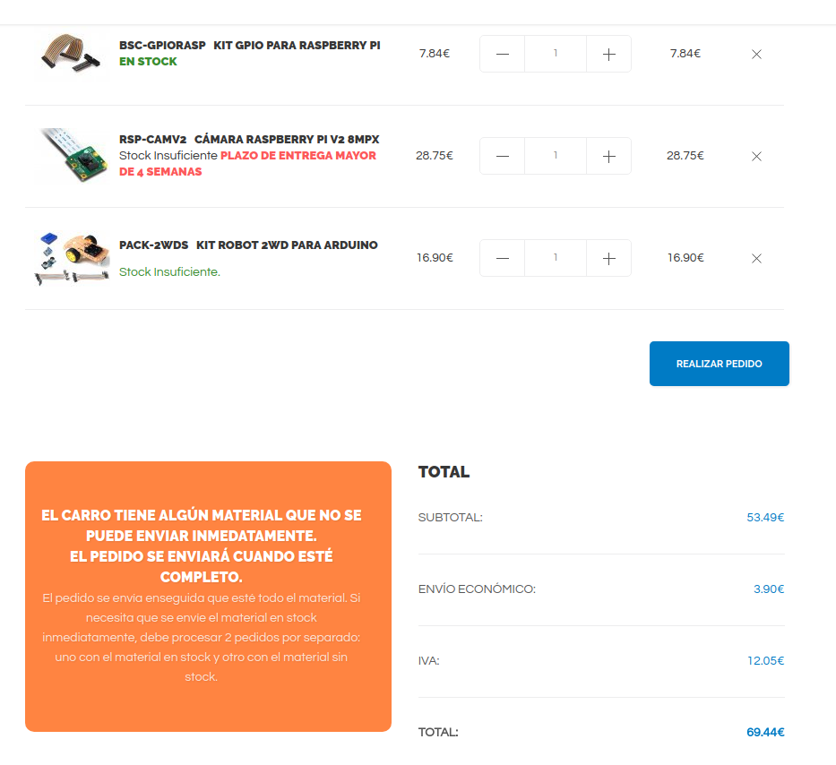

# Raspberry Avanzado

Propuesta de temario para el curso de Raspberry Avanzado (20 horas)

Se distribuyen en 3 módulos:

## Administracion y sistemas (6h)

* Linux Avanzado
* Clonación de tarjetas
* Instalación de servidores
  * Servidor de ficheros
  * Servidor Web
  * Firewall

## Programación (6h)

* Programación en python
* Control de la cámara
* Reconocimiento de imágenes

## Electrónica y programación Nivel 1 (8h)

Programamos y montamos proyectos con los siguientes componentes

Usamos scratch para empezar con la electrónica y pasamos a python

* Montajes electrónicos sencillos:
  * Leds y pulsadores
  * Sensores de temperatura y humedad
  * Servos
  * Pantalla LCD I2C
  * Robot móvil
  

### Material

Para la parte de programación y electrónica harían falta los siguientes materiales

* [Leds y pulsadores](http://inven.es/componentes-electronicos/110-pack-electronica-1.html)
* Sensores de temperatura y humedad [DHT22](http://inven.es/temperatura-y-humedad/79-sensor-de-temperatura-y-humedad-dht22.html
* [Servo](http://inven.es/motores-y-servomotores/37-micro-servomotor-tower-pro-sg-90.html)
* [LCD I2C](http://inven.es/pantallas-y-display/8-lcd-16x2.html)
* [Cables](http://inven.es/temperatura-y-humedad/79-sensor-de-temperatura-y-humedad-dht22.html)
* [Chasis de robot móvil](http://www.electan.com/kit-robot-2wd-para-arduino-p-7196.html)
* [Placa de conexión a Raspberry](http://www.electan.com/kit-gpio-para-raspberry-p-6592.html)
* [Cámara de Raspberry](http://www.electan.com/camara-8mpx-para-raspberry-p-6558.html)

