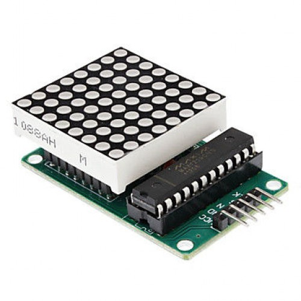

# Matriz de leds con MAX7219

[Componente de Fritzing de la matriz led](https://github.com/RafaGS/Fritzing/blob/master/Matrix%20LED%20de%208x8%20basada%20en%20MAX7219.fzpz)

## Libreria rm-hull

[Libreria para MAX7219, neopixel, 7-segments](https://github.com/rm-hull/luma.led_matrix)

Instalamos luma.core https://github.com/rm-hull/luma.core (sudo pip -i ./)

[Documentaci'on](https://luma-led-matrix.readthedocs.io/en/latest/)

[PRoblemas con la instalacion de luma.core](http://www.circuitbasics.com/raspberry-pi-i2c-lcd-set-up-and-programming/)

## Librer'ia Max7219 Driver

Permite usar python 2 y 3

[Libreria Max7219]
[Documentacion](http://max7219.readthedocs.io/en/latest/)

## Libreria multiples MAX7219

[Librer'ia](https://tutorials-raspberrypi.com/library-installation-for-multiline-m-x-n-max7219-led-matrices/)

## Soluci'on de PRoblemas

[SPI TroubleShooting](https://www.raspberrypi.org/documentation/hardware/raspberrypi/spi/README.md#troubleshooting)

## Recursos

[Ejemplo de programa python con GUI para manejar el MAX7219](http://www.scienceexposure.com/raspberry-pi/max7219-led-matrix-gui-controller-python-library/) Usa la libreria Luma de rm-hull (https://github.com/rm-hull/luma.led_matrix)

[Setup de i2c y spi](https://learn.sparkfun.com/tutorials/raspberry-pi-spi-and-i2c-tutorial#spi-on-pi)
