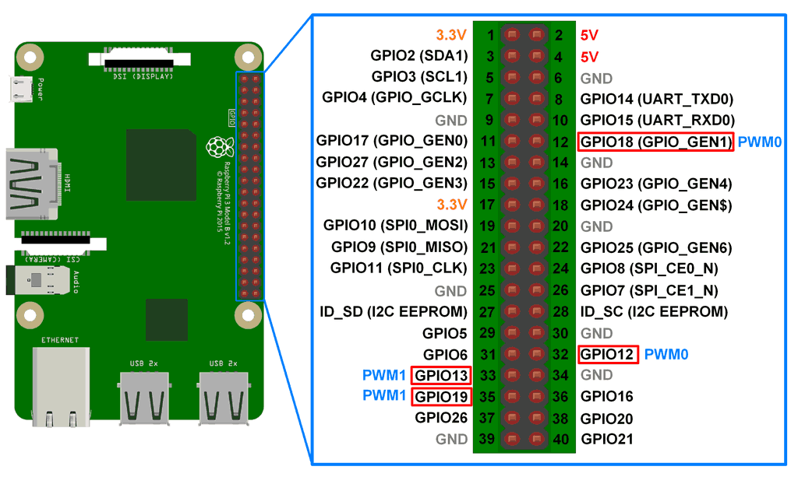
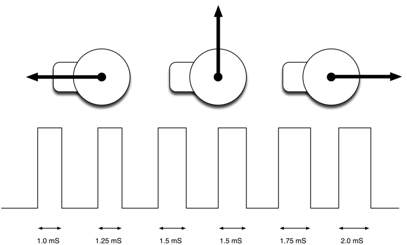

# Servos

Se controlan desde los pines con capacidad PWM

Necesitan un pulso cada 20 ms, su duración indica el ángulo:
* 1 ms indica 0º
* 2 ms indica 180º

[Placa para controlar PWM](https://www.adafruit.com/product/815)

## Controlando servos desde shell (consola/terminal)

Instalamos la libreria wiringpi

      sudo apt install  wiringpi

      gpio -g mode 18 pwm
      gpio pwm-ms
      gpio pwmc 192
      gpio pwmr 2000
      gpio -g pwm 18 100
      gpio -g pwm 18 150
      gpio -g pwm 18 100
      gpio -g pwm 18 150
      gpio -g pwm 18 200
      gpio -g pwm 18 15

## Controlando servos con python

Instalamos la libreria wiring para python

    sudo apt install python-pip
    sudo pip install wiringpi

Usaremos el siguiente codigo para mover python

    # Servo Control
    import time
    import wiringpi

    # use 'GPIO naming'
    wiringpi.wiringPiSetupGpio()

    # set #18 to be a PWM output
    wiringpi.pinMode(18, wiringpi.GPIO.PWM_OUTPUT)

    # set the PWM mode to milliseconds stype
    wiringpi.pwmSetMode(wiringpi.GPIO.PWM_MODE_MS)

    # divide down clock
    wiringpi.pwmSetClock(192)
    wiringpi.pwmSetRange(2000)

    delay_period = 0.01

    while True:
            for pulse in range(50, 250, 1):
                    wiringpi.pwmWrite(18, pulse)
                    time.sleep(delay_period)
            for pulse in range(250, 50, -1):
                    wiringpi.pwmWrite(18, pulse)
                    time.sleep(delay_period)

## Referencias

[Tutorial Adafruit by Simon Monk](https://learn.adafruit.com/adafruits-raspberry-pi-lesson-8-using-a-servo-motor?view=all)
