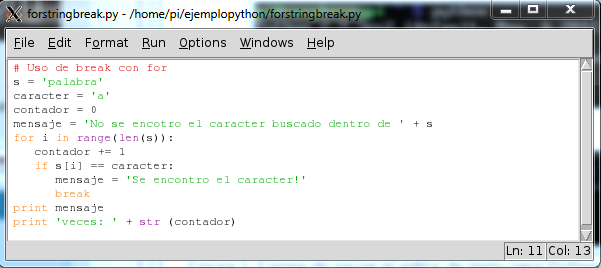

# Raspberry Avanzado

Febrero-Marzo 2018

## CEP Linares-Andujar ([182319GE077](https://www.juntadeandalucia.es/educacion/secretariavirtual/consultaCEP/actividad/182319GE077/))

## https://github.com/javacasm/RaspberryAvanzado

### José Antonio Vacas @javacasm


# Python


Es un lenguaje moderno de gran productividad, sencillo, potente y con millones de líneas ya desarrolladas que se pueden usar directamente por medio de paquetes instalables

Se utiliza en la web, en aplicaciones de escritorio, etc... Gran parte del interface de linux lo utiliza

Existen dos versiones de python ahora mismo: la rama 2.x y la 3.x
Por sencillez vamos a usar la sintaxis de la rama 2.x

Podemos utilizar la herramienta Idle o python directamente para programar con él.



Es más sencillo si escribimos nuestro código en un fichero (con cualquier editor de texto) y luego lo ejecutamos o bien abriéndolo con idle o haciendo:

    python fichero.py


Veamos algunos ejemplos

## Operaciones numéricas y petición de datos al usuario

[Código de Suma](./codigo/suma.py)

```python
# Programa que realiza la suma de dos valores
a=input('numero 1');
b=input('numero 2');
suma = a + b;
print (suma);
```

**Ejercicio**: cambia la operación a realizar

### Sentencias de control condicionales

[Código de Bisiesto](./codigo/bisiesto.py)

```python
# Programa que determina si un año es o no bisiesto
year = input('Introduzca el anio: ');
if ((year%400)==0  or (year % 100) ==0 or (year%4)==0):
  print 'Es bisiesto!!';
else:
  print 'No es bisiesto!!';
```

[Código de días por mes](./codigo/diasMes.py)

```python
# Nos da los dias que tiene el mes seleccionado
mes = input('Introduce el mes:');
year = input('Introuce el anio:');
# Comprobamos si es entero
if type(mes) == int:
  # Comprobamos si esta entre 1 y 12
  if (mes>=1) and (mes<=12):
    if mes == 2:
      if(year%400 == 0) or (year%100 ==0) or (year %4 == 0):
        dias = 29;
      else:
        dias =28;
    elif (mes==4) or (mes==6) or (mes==9) or (mes==11):
      dias = 30;
    else:
      dias = 31;
    print 'El mes '+str(mes) +' del anio '+str(year)+' tiene '+str(dias)+ ' dias';
  else:
    print 'El mes debe ser entre 1 y 12';
else:
  print 'El mes debe ser entero';
```

### Sentencias de control de repetición

[Código de Buscando Caracteres](./codigo/buscaCaracter.py)

```python
# Cuenta las veces que se repite un caracter en una palabra
word= 'palabra';
caracter = 'a';
contador=0;
mensaje='No se ha encontrado el caracter :('
for i in range(len(word)):
  if (word[i]==caracter):
    mensaje='se ha encontrado el caracter!!!';
    contador=contador+1;

print mensaje;
print 'Se encontrado '+str(contador)+' veces';
```

**Ejercicio**: haz que el usuario pueda introducir la cadena donde buscar y el caracter

### Diccionarios que nos permitirán relacionar contenidos

Podemos introducir estas líneas en idle (las que empiezan por >>>)


### Programa complejo

Veamos una implementación de un programa más elaborado como "Piedra, Papel o Tijera"


